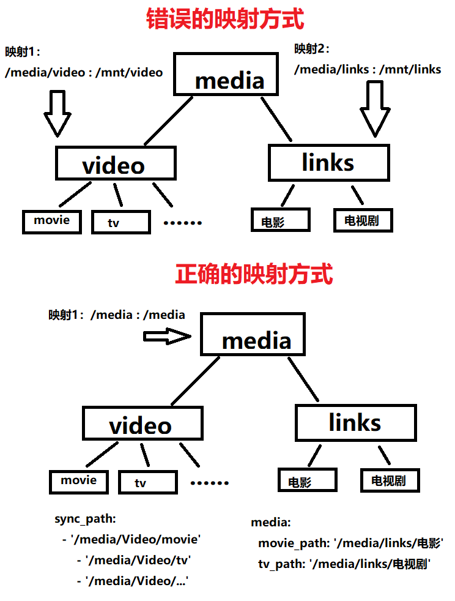

## 特点

- 基于 Debian 13 slim，镜像体积小；
- 支持 amd64/arm64 架构；
- 内置 nginx + 独立前端（Vue 3），前后端分离；
- 统一对外端口 3010，nginx 代理 API 到 Flask 后端；
- 重启即可更新程序，如果依赖有变化，会自动尝试重新安装依赖；
- 可以以非 root 用户执行任务，降低程序权限和潜在风险；
- 可以设置文件掩码权限 umask。

## 创建

**docker cli**

```
docker run -d \
    --name nas-tools \
    --hostname nas-tools \
    -p 3010:3010 \
    -v $(pwd)/config:/config \
    -v /你的媒体目录:/你想设置的容器内能见到的目录 \
    -e PUID=0 \
    -e PGID=0 \
    -e UMASK=000 \
    coolkid903/nas-tools
```

**docker-compose**

```yaml
version: "3"
services:
  nas-tools:
    image: coolkid903/nas-tools:latest
    ports:
      - 3010:3010
    volumes:
      - ./config:/config
      - /你的媒体目录:/你想设置的容器内能见到的目录
    environment:
      - PUID=0
      - PGID=0
      - UMASK=000
    restart: always
    network_mode: bridge
    hostname: nas-tools
    container_name: nas-tools
```

## 后续如何更新

- 使用 `docker compose pull && docker compose up -d --force-recreate` 更新。

## 关于 PUID/PGID 的说明

- 如在使用诸如 emby、jellyfin、plex、qbittorrent、transmission、deluge、jackett、sonarr、radarr 等 docker 镜像，请保证创建本容器时的 PUID/PGID 和它们一样。
- 在 docker 宿主上，登陆媒体文件所有者的这个用户，然后分别输入 `id -u` 和 `id -g` 可获取到 uid 和 gid，分别设置为 PUID 和 PGID。
- `PUID=0` `PGID=0` 指 root 用户，若你的媒体文件的所有者不是 root，不建议设置为 `PUID=0` `PGID=0`。

## 如果要硬连接如何映射

参考下图，由 imogel@telegram 制作。


